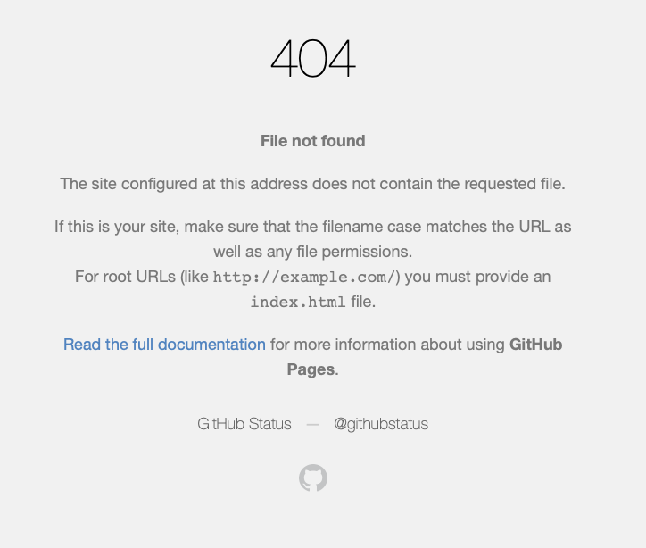

# qlive

Repository to prototype apps using shinylive and quarto-live

I initially chose an example from the shinylive gallery and I was able to reproduce it. Then I added more complexity and below is what was landed on.

I wrote code to show the congruence of statistics generated by either built-in or linear model functions in R as outlined in the [cheatsheet by tests-as-linear on Github](https://github.com/lindeloev/tests-as-linear).

The DESCRIPTION file has all the required packages and the renv.lock file was meticulously made to ensure the right package versions are recorded for {shinylive}. I also snapshotted the CRAN mirror as seen in the .Rprofile.

By going through the [{shinylive} documentation](https://github.com/posit-dev/r-shinylive), I installed `{shinylive}` and followed the instructions below:

``` r
shinylive::export(".", "site") # Took about 20 seconds
httpuv::runStaticServer("site")
```

Oh wow, the `site/` directory for this small app is almost 130MB!

As outlined in [an example](https://github.com/wch/shinylive-example) by Winston at Posit, I'm going to use github actions to deploy this to Github Pages. After modification I settled on the workflow in this repository. Everything in the workflow is required!

You can view the final deployed app at <https://ngiangre.github.io/qlive/>. It should look like this:


But for some reason I am getting a 404 error:



I'm wondering if the size of all the assets is a factor especially for Github Pages. Anyway, would have been cool to get this working on the free tier! But glad to know the site renders locally and all these packages are handled by shinylive. It takes a minute or two to fully render but not too bad. Very worthwhile experiment!

